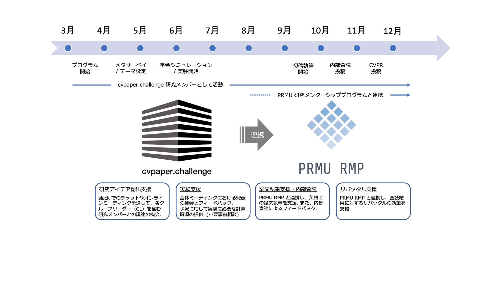

.. include:: ../global.txt

:menuselection:`Home --> schedule --> 2022`

================================
Schedule 2022
================================

.. important::
    The following schedule is only a tentative one and **may change flexibly** 
    depending on the progress of the research.

Sample Schedule
================================

Here is an example of a schedule for submitting to CVPR.

.. note::
    Although it is not absolutely necessary to submit papers to CVPR, 
    we have set **CVPR as the target in principle** from the viewpoint of collaboration with PRMU RMP.

Late March
--------------------------------
-   **Kickoff** （キックオフ）: 
    
    | The challenge of being a member of the XCCV group begins.

April - May
--------------------------------

-   **Meta-survey** （メタサーベイ）:

    | In order to clarify the trends in the field and the position of your own research idea, 
      you conduct a comprehensive survey of related research and prepare a summary slide.

-   **Theme setting** （テーマ設定）:

    | Establishing a research theme based on the findings of the meta-survey and your idea. 
      We plan to apply a method called an `Inception Deck`_ to clarify the research theme.

.. _Inception Deck: https://agilewarrior.wordpress.com/2010/11/06/the-agile-inception-deck/

June - Early October
--------------------------------

-   **Conference simulation** （学会シミュレーション）:
    
    | Write a short paper or proposal based on your theme and hypothesis, and present it in a conference simulation.
      Discuss and sharpen your theme with other group members.

-   **PRMU RMP linking** （PRMU RMP 連携）: 

    | By linking to the PRMU RMP, a support for experiments 
      and writing papers is provided.

.. important::
    Depending on your research theme, you may not be matched with a mentor of PRMU RMP.

.. important::
    When linking with PRMU RMP, **the co-authorship may be limited depending on the member's organization**. 
    **PLEASE CHECK IF THERE ARE ANY PROBLEMS IN THE CO-AUTHORSHIP** immediately after the linking.    

Late October - Early Nobember
--------------------------------
-   **Community review** （コミュニティ内査読）:
    
    | Have your paper peer-reviewed by the cvpaper.challenge community to 
      improve the quality of your paper and further develop your research.

After submission
--------------------------------
-   **Rebuttal** （リバッタル）:

    | Through the linking to the PRMU RMP, a support for rebuttal is provided.

Important Dates
================================

**2022/04/01**: Conference Simulation Paper Submission Form Opened

**2022/04/21**: Conference Simulation Paper Registration Deadline

**2022/04/28**: Conference Simulation Paper Submission Deadline & Meta-Survery Submission Deadline 
